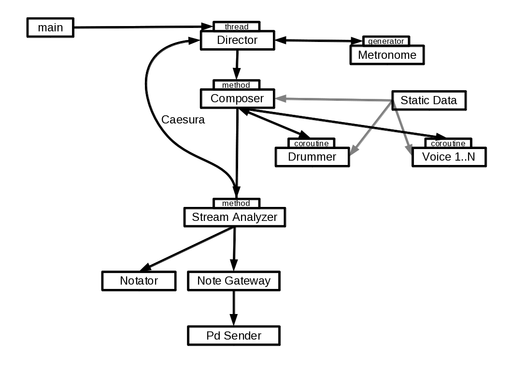

Overview
========

diagram
-------

_`introduction`
---------------

| main starts a thread in which the app runs.
| director contains the main loop in its `_play` method. 
| `_play` calls the _Composers_ (synchronous) `generate` method following the metronome's clock
| `generate` calls the voices' coroutines until a satisfactory harmonic result is obtained.
| the stream-analyzer (and performer) controls if there are drum-fills or embellishments to be added. it also checks for conditions of a ceasura.
| If a caesura is given, a flag is set which the director uses to modify its behaviour.
| Finally the musical frame is sent to both the Note-Gateway and the Notator module.

.. toctree::
    :maxdepth: 1

    events_and_messages
